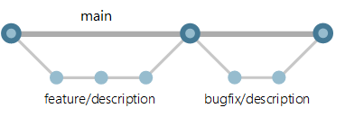
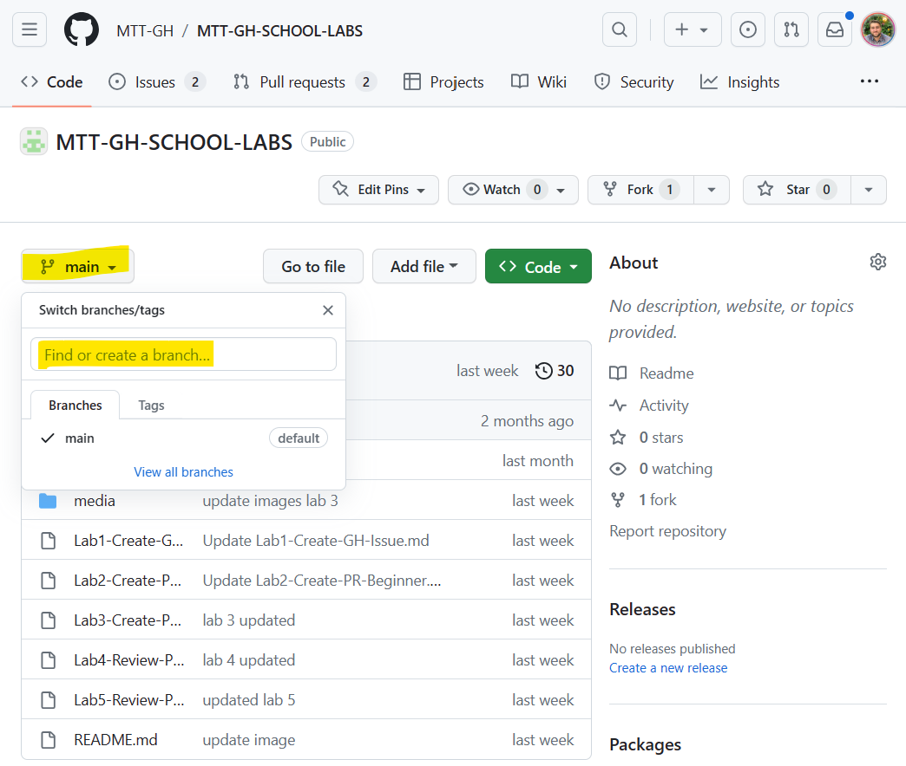
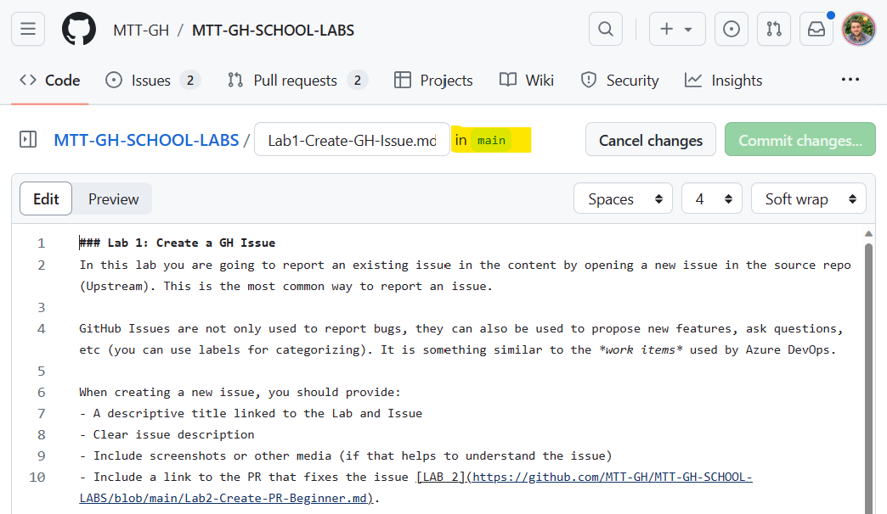

[comment]: <> (please keep all comment items at the top of the markdown file)
[comment]: <> (please do not change the ***, as well as 
 placeholders for Note and Tip layout)

# GIT Branching
***

## Introduction

  3 minutes

Before covering the **Pull Request** feature, it will be important to understand some GIT basics , such as **Branching**.

Branching is a core concept in GIT. It allows you to create multiple branches for your code repo and work on them independently. This is useful when you want to add a new feature or fix a bug without affecting the main codebase. Once you are done with the changes, you can merge the branch with the main codebase.

Based on this idea, many branching strategies have been developed, such as GitHub Flow, GitFlow, and others. Here you can find a common branching strategy used by many Microsoft teams : [How Microsoft develops with DevOps](https://learn.microsoft.com/en-us/devops/develop/how-microsoft-develops-devops)

As an MTT , you will mostly use a simple feature branching strategy that works the following way:

- **Main** branch : This is the main branch of the repository. It contains the latest stable version of the codebase. As a maintainer you usually protect the main branch so that changes can only be merged through Pull Requests.
- **Feature** branch : This is a temporary branch that is created to work on a new feature or fix a bug. It is created from the main branch and merged back into the main branch once the changes are complete, mostly using a Pull Request. 

            
**Note:** As you will see during the labs, the "feature" branch could be coming either from the same repo (if created by maintainer) or from a forked repo (if created by a contributor). In both cases, the "feature" branch will be merged back to the main branch of the original repo.

## Branches in GitHub 

You can view, edit and create branches in GitHub from the **Code** tab of the repository page, clicking on the default branch dropdown:

When you are editing a file using the GitHub editor , you will see the chosen branch name on top of the file, that is the branch we commits are going to be pushed to:

## [NEW] GitHub Issue Projects

GitHub Projects is a feature that allows you to organize and prioritize your work. It is a Kanban-style tool that provides a visual overview of your project. It helps you to track the progress of your work and stay on top of your project.

**This feature will not be covered as part of the training.**

<iframe width="560" height="315" src="https://www.youtube.com/embed/o1wuW24Nv4E" title="YouTube video player" frameborder="0" allow="accelerometer; autoplay; clipboard-write; encrypted-media; gyroscope; picture-in-picture; web-share" allowfullscreen></iframe>
